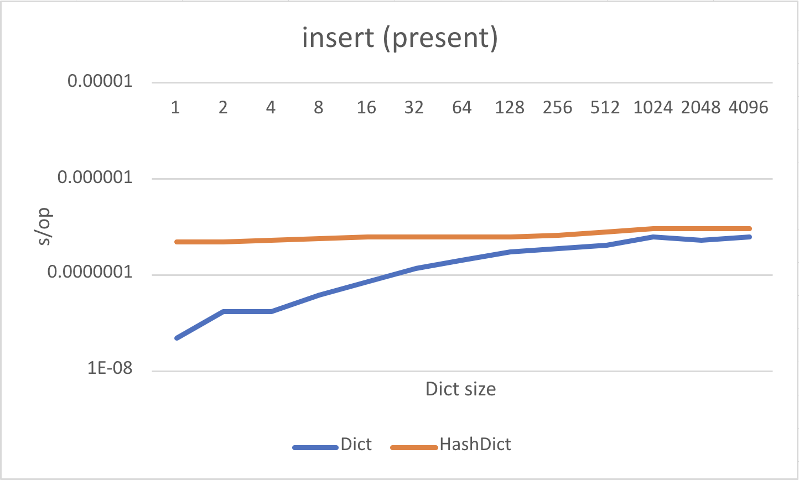

# elm-hash-dict

Gets are constant across dict sizes and outperform Dict above ~16 items:

 

At the expense of longer insertion times:

 

## Credits

Inspired by

* [Fast Dictionary in F#](https://www.youtube.com/playlist?list=PLqWncHdBPoD4-d_VSZ0MB0IBKQY0rwYLd) and its [repo](https://github.com/matthewcrews/FastDictionaryTest)
* [C++Now 2018: You Can Do Better than std::unordered_map: New improvements to Hash Table Performance](https://www.youtube.com/watch?v=M2fKMP47slQ)
